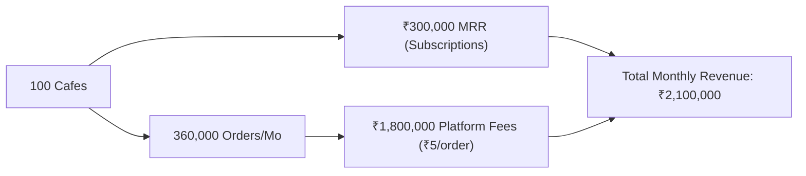

# TSOS Business & SaaS Strategy Documentation

- **Product**: TSOS (The Cafe Operating System)
- **Document Version**: 2.2.0
- **Scope**: Multi-Tenant B2B SaaS Business Model, Unit Economics, Monetization & ROI

---

## 1. Executive Summary & Market Opportunity

Independent specialty coffee shops, artisan bakeries, and quick-service restaurants (QSRs) are trapped between two broken extremes:
1. **Predatory Aggregators**: Food delivery apps taking 20–30% commissions on digital orders while monopolizing customer data and loyalty.
2. **Antiquated Legacy POS Systems**: Heavy, proprietary Windows terminals costing ₹50,000+ upfront with rigid contracts, zero tableside ordering, and disconnected kitchen workflows.

**TSOS (The Cafe Operating System)** bridges this divide as a modern, cloud-native B2B SaaS operating system. By enabling direct tableside QR ordering with 10-minute anti-fraud protection, real-time Kitchen Display Systems (KDS), and automated recipe inventory depletion on commodity consumer hardware (iPads, Android tablets, laptops, phones), TSOS lowers the cost of opening and operating a specialty food business.

---

## 2. Target Market Segments

```
               ┌────────────────────────────────────────────────────────┐
               │              Target Hospitality Segments               │
               └────────────────────────────────────────────────────────┘
                                           │
         ┌───────────────────┬─────────────┴───────┬───────────────────┐
         ▼                   ▼                     ▼                   ▼
 Specialty Coffee     Artisan Bakeries      QSR & Fast Casual    Multi-Outlet Chains
  • Micro-roasters     • Pre-orders          • High peak rushes   • Franchisees
  • Pour-over bars     • Recipe batching     • Rapid counter POS  • Centralized menu
  • Loyalty regulars   • Expiry tracking     • Digital KDS lines  • Global reports
```

1. **Specialty Coffee Bars & Micro-Roasters**: Need fast single-item espresso workflows, modifier variants (oat milk, extra shot), and recurring loyalty rewards for daily regulars.
2. **Artisan Bakeries & Patisseries**: Require exact gram/milliliter recipe deduction to control butter, flour, and cocoa bean shrinkage.
3. **High-Velocity Quick Service Restaurants (QSRs)**: Require rapid 5-second counter order capture and synchronized kitchen ticket countdowns to maintain SLA under 3 minutes.
4. **Multi-Location Cafe Chains**: Require centralized SuperAdmin controls, multi-store menu publishing, consolidated sales telemetry, and role-based staff permissions.

---

## 3. Subscription Pricing & Monetization Model

TSOS employs a hybrid SaaS monetization model combining predictable monthly subscriptions with a lightweight per-order transaction fee.

### 3.1 SaaS Subscription Tiers

| Tier | Monthly Rate | Locations | Terminals / KDS | Key Capabilities |
|---|---|---|---|---|
| **Starter** | **₹1,499** / mo | 1 Outlet | 1 POS Station | Counter billing, UPI QR payments, basic sales reports, thermal receipt generation. |
| **Pro** | **₹2,999** / mo | Up to 2 Outlets | Unlimited POS & KDS | Dynamic tableside QR ordering with 10m ephemeral sessions, automated recipe inventory depletion, staff shift drawer audit, and loyalty CRM. |
| **Enterprise** | **₹5,999** / mo | Unlimited | Unlimited Stations | Centralized multi-store franchise dashboard, developer API access, custom branding, dedicated account manager, and priority 99.9% SLA. |

### 3.2 Hybrid Platform Fee Engine
In addition to subscriptions, TSOS includes a configurable platform fee engine on tableside self-orders:
- **Default Fee**: ₹5 per completed QR tableside order.
- **Configurable Payer Model**:
  - `Customer Payer`: Added transparently to the guest's checkout bill as a "Platform Convenience Fee" (zero cost to the cafe owner).
  - `Merchant Payer`: Deducted from merchant payout or added to monthly billing.
- **Quota Auto-Flip**: Free tier allowance of 250 orders/month; fee engine activates automatically after quota exhaustion.

---

## 4. Operator Return on Investment (ROI) & Payback Model

For an average independent cafe doing **120 orders per day** at an Average Order Value (AOV) of **₹350**:

```
Monthly Gross Merchandise Value (GMV): 120 orders * 30 days * ₹350 = ₹1,260,000 / month
```

| Operational Area | Without TSOS | With TSOS | Monthly Savings |
|---|---|---|---|
| **Front-of-House Labor** | 3 servers running paper menus, taking orders, and processing card machines. | 1 runner/server; diners order and pay directly via 10-minute tableside QR. | **₹22,000** (1 less staff salary) |
| **Ingredient Shrinkage & Waste** | Unmonitored milk/coffee bean overuse; 7% monthly loss. | Automated recipe depletion with reorder alerts; loss reduced to 2%. | **₹18,900** (saved food costs) |
| **Table Turnover Velocity** | 45-minute average dining stay (waiting for bill and card terminal). | 35-minute average stay (instant self-settlement via UPI). | **+22% Table Capacity** (~₹60,000 incremental revenue) |
| **Accidental Remote Orders** | Ghost orders from home browser history causing food waste. | 10-Minute Ephemeral QR auto-lock completely blocks remote orders. | **₹3,500** (zero wasted tickets) |
| **Total Monthly Net Benefit** | — | — | **+₹104,400 / month** |

> **Payback Period**: With the TSOS Pro subscription at ₹2,999/month, the investment pays for itself within **24 hours** of monthly operations.

---

## 5. Loyalty Mechanics & Customer Lifetime Value (LTV)

Repeat customers represent 68% of specialty cafe revenues. TSOS implements an automated, gamified loyalty engine:

### 5.1 The Accrual & Redemption Math
- **Point Accrual**: 1 loyalty point earned for every ₹10 spent (effective 10% point accrual rate).
- **Point Redemption**: 1 loyalty point = ₹1 direct discount at checkout.
- **Redemption Cap**: Maximum redemption capped at 50% of order subtotal to preserve cafe profit margins.

### 5.2 Gamified Customer Tiers

```
[Bronze: <100 pts] ──> [Silver: 100-249 pts] ──> [Gold: 250-499 pts] ──> [Platinum: 500+ pts]
      Base                 Free Milk Sub             10% Special            Free Weekly
   Registration             (Oat / Almond)           Event Invites          Coffee Tasting
```

- **Registration Bonus**: Instant 25 welcome points on first phone number entry.
- **Double-Entry Ledger**: Every point credited or debited is recorded with an immutable transaction ID in `loyalty_ledgers`, preventing staff tampering.

---

## 6. SuperAdmin Economics & SaaS Growth Roadmap



### Strategic Growth Initiatives
1. **Integrated Soundbox & Payments**: Partner with domestic payment aggregators (Razorpay, Paytm, Cashfree) to ship branded UPI audio soundboxes for instant counter payment verification.
2. **Direct Supplier Marketplace**: Allow coffee bean roasters and dairy distributors to accept automated purchase orders directly from TSOS low-stock notifications.
3. **Franchise Analytics Intelligence**: Benchmark top-selling SKUs, hourly staffing efficiency, and prep SLA across all participating franchise outlets.
4. **Hardware Flexibility & Zero Lock-in**: Offer turnkey Windows POS (.exe), Android Tablet APKs, and browser-first PWA clients so cafes can utilize existing hardware without buying expensive proprietary terminals.

