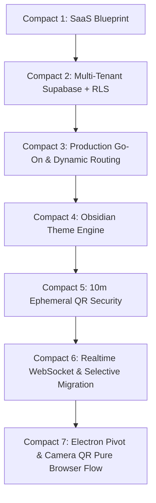

# TSOS Compacts & Trajectory Archive

This directory maintains comprehensive, chronological snapshot summaries of all major conversation milestones, architectural directives, and engineering phases of the **TSOS Multi-Tenant Cafe Operating System**.

---

## Index of Compacts

| Compact | Date | Milestone / Focus | Status | Primary Artifacts |
|---|---|---|---|---|
| **[Compact 1](compact1.md)** | 2026-09-25 | SaaS Architecture & Multi-Tenant Briefing | Completed | Architecture models, tenant entity definitions, role-based access rules |
| **[Compact 2](compact2.md)** | 2026-09-25 | Supabase Multi-Tenant Database & RLS Migration | Completed | `supabase/migrations/001_multi_tenant_saas.sql`, 24 tables, RLS policies, RPCs |
| **[Compact 3](compact3.md)** | 2026-09-25 | Production Go-On Conversion & Chrome Purge | Completed | Prototype chrome elimination, path-based routing (`/:slug/pos`, `/:slug/kds`) |
| **[Compact 4](compact4.md)** | 2026-09-25 | Obsidian Mode & System-Wide Theme Engine | Completed | High-contrast industrial terminal design, global single-button header toggle |
| **[Compact 5](compact5.md)** | 2026-09-25 | 10-Minute Ephemeral Table QR Session Security | Completed | `schema.sql`, `sessionService.ts`, `useTableSession.ts`, auto-lock overlay |
| **[Compact 6](compact6.md)** | 2026-09-25 | Comparative Audit & Selective Feature Migration | Completed | Real-time WebSockets, offline order queue, fast PIN modal |
| **[Compact 7](compact7.md)** | 2026-09-25 | Hardware Hub Purge & Electron Strategy Pivot | Completed | Removed Hardware Hub, froze WPF for Electron, pure camera QR browser ordering |

---

## Architectural Trajectory Summary

