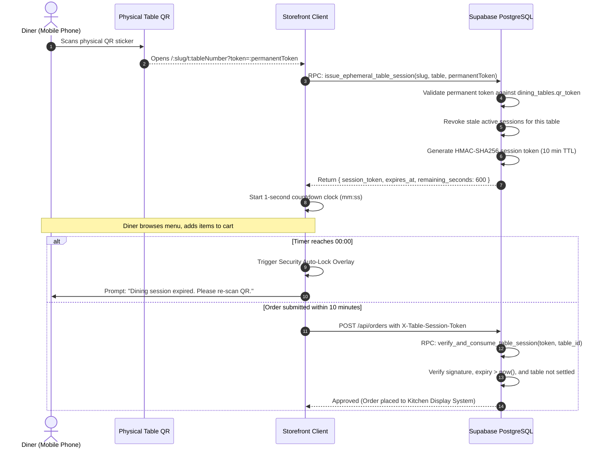

# Research & Threat Model: Ephemeral Table QR Session Security

- **Author**: Lead Full-Stack Security Architect
- **Target Platform**: TSOS Cloud POS & Tableside Self-Ordering Storefront
- **Date**: 2026-09-25

---

## 1. Threat Modeling: The "Ghost Order" Vector

### 1.1 Vulnerability Description
Conventional QR-code tableside ordering systems encode a static URL containing the table number and a permanent signature:
```
https://cafe.com/coolkafe/t4?token=sec_abc123
```
When a diner scans this code:
1. The smartphone browser loads the menu and stores the URL in its navigation history and cache.
2. The user might add items to their cart, complete payment, and leave the restaurant.
3. Days later, when the user launches Safari or Chrome on their phone to search for unrelated topics, modern mobile browsers frequently auto-restore previous tabs or auto-suggest the URL from history.
4. If the diner inadvertently taps the browser window or reopens their active cart, a new order is dispatched over HTTP.
5. In the restaurant, the kitchen ticket printer prints an order for Table 4. Staff prepare the food, but Table 4 is currently occupied by someone else, or the diner is not there.

### 1.2 Attack & Accidental Vectors

| Vector | Description | Severity | Mitigation in TSOS |
|---|---|---|---|
| **Accidental History Replay** | User reopens mobile browser days later; background reload or accidental click triggers an order. | High | 10-Minute Ephemeral Token with server-side expiry (`expires_at < now()`). |
| **Cross-Table Spoofing** | Attacker sitting at Table 1 scans their code, changes payload to Table 8 to harass another party. | Critical | Server-side cryptographic check: `session.table_id == order.table_id`. |
| **Post-Settlement Ordering** | Diner finishes meal, cashier settles the bill; diner's companion later tries to order more. | Medium | Table status check in `verify_and_consume_table_session`: rejects if table is `'settled'`. |
| **Stale Session Flooding** | Accumulation of millions of expired session rows in PostgreSQL. | Low | Automated purge procedure `purge_expired_table_sessions()` removing records > 24 hours old. |

---

## 2. Cryptographic Protocol: Dual-Token Architecture



---

## 3. Cryptographic Token Structure

The ephemeral token format is structured for high entropy and offline/online cryptographic verification:
```
tsos_tkn_<16-byte-random-hex>_<16-byte-hmac-digest>
```
1. **Entropy Prefix**: 16 bytes of cryptographically secure random bytes generated via `pgcrypto` (`gen_random_bytes(16)`).
2. **Signature Suffix**: Truncated 16-byte hexadecimal representation of `HMAC-SHA256(session_id:table_id:expires_at, secret_salt)`.
3. **Database Hash**: In `table_sessions`, the full HMAC digest is indexed via `idx_table_sessions_token`.

---

## 4. Frontend Resilience & Clock Drift Handling

1. **Monotonic Expiry Anchoring**: The client does not decrement a simple integer; it anchors the absolute expiration timestamp (`expiresAtRef.current = expiresAtMs`) and computes remaining seconds against `Date.now()`.
2. **Local Storage Fallback**: The active session is mirrored to `localStorage` under `tsos_session_<slug>_<tableNumber>`. If the diner refreshes the browser page within their 10-minute window, their session resumes seamlessly without requiring a re-scan.
3. **2-Minute Warning Banner**: At $\le$ 120 seconds, an amber banner appears with a one-click renewal trigger, preventing frustrating session loss during cart review.
4. **Renewal Handshake**: Diners can extend their session by tapping "Renew", which verifies the physical table token and grants a fresh 10-minute lease.
