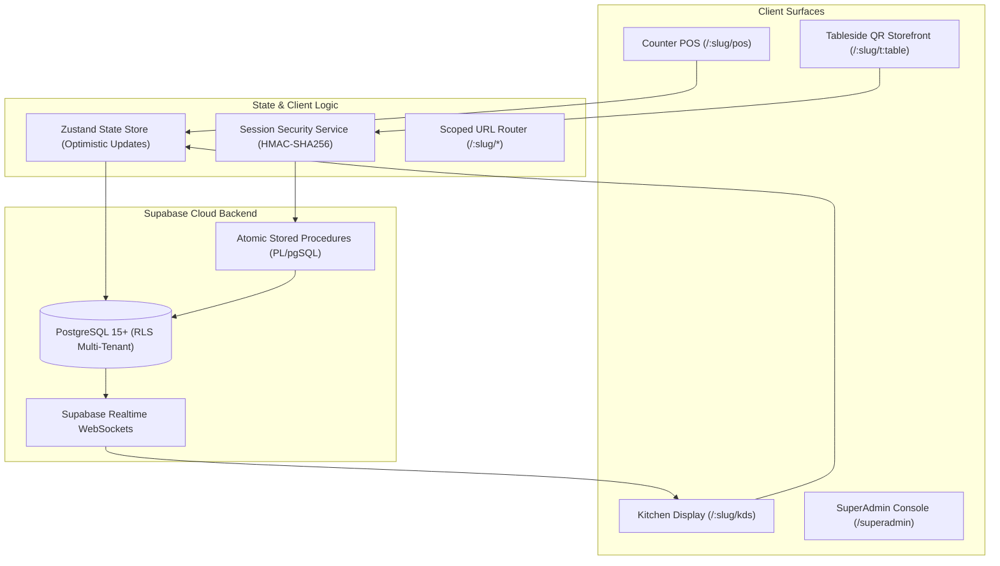
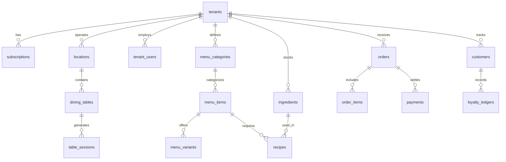

# TSOS Technical Documentation & Architecture Specification

- **System**: TSOS (The Cafe Operating System)
- **Version**: 2.2.0
- **Architect**: Lead Full-Stack Security & Platform Architect
- **Updated**: September 25, 2026

---

## 1. System Overview & Architecture

TSOS is a cloud-native, multi-tenant B2B SaaS platform engineered specifically for cafes, specialty coffee roasters, bakeries, and quick-service restaurants (QSRs). It provides a unified system spanning counter POS, kitchen display (KDS), inventory recipe depletion, shifts reconciliation, and guest tableside self-ordering.



---

## 2. Frontend Architecture

### 2.1 Technology Stack
- **Framework**: React 18 with TypeScript 5.2.
- **Build Tool**: Vite 6 (ESM-native fast HMR and optimized production bundling).
- **Styling**: Tailwind CSS with custom design tokens for Warm Cafe Cream and Obsidian Dark Terminal.
- **Icons**: Lucide React.
- **State Management**: Zustand with `persist` middleware for zero-latency local caching.

### 2.2 Component Hierarchy & Surfaces
- `src/App.tsx`: Root router parsing path-based tenant slugs and rendering active surface components.
- `src/components/layout/Header.tsx`: Global system bar featuring tenant identity, offline/online sync status pill, shift indicator, and the **single-button Obsidian Mode toggle**.
- `src/components/layout/NavigationSidebar.tsx`: Surface switcher for authenticated staff (POS, KDS, Orders, Inventory, Reports, Settings).
- `src/components/pos/PosScreen.tsx`: High-velocity cash register with category tabs, dish search, customizable modifiers modal (`VariantModal`), dine-in table selector, and cart drawer.
- `src/components/kds/KdsScreen.tsx`: Kitchen display pipeline showing active tickets grouped by stage (`new`, `preparing`, `ready`, `completed`) with SLA progress timers.
- `src/components/storefront/StorefrontScreen.tsx`: Guest mobile self-ordering surface with live 10-minute session countdown, warning banners, security auto-lock modal, and UPI payment integration.

---

## 3. Dynamic Scoped Path-Based Routing Engine

The routing layer extracts tenant slugs dynamically from the window location pathname:

| Route Pattern | Target Component | Access Role | Description |
|---|---|---|---|
| `/:slug/pos` | `PosScreen` | Cashier, Manager, Owner | Scoped point of sale billing terminal. |
| `/:slug/kds` | `KdsScreen` | Kitchen Staff, Barista | Real-time kitchen display board. |
| `/:slug/orders` | `OrdersScreen` | Cashier, Manager | Master order directory with status filtering & receipt reprinting. |
| `/:slug/inventory` | `InventoryScreen` | Manager, Owner | Ingredient stock ledger and recipe consumption costs. |
| `/:slug/reports` | `ReportsScreen` | Manager, Owner | Sales telemetry, payment modes, and tax reporting. |
| `/:slug/settings` | `SettingsScreen` | Owner, Manager | Outlet profile, thermal printers, and tax configuration. |
| `/:slug/t:tableNumber?token=:token` | `StorefrontScreen` | Anonymous Diner | Guest self-ordering with 10-minute ephemeral session validation. |
| `/superadmin` | `SuperAdminScreen` | Platform SuperAdmin | Tenant provisioning, SaaS telemetry, and workspace impersonation. |

---

## 4. Supabase Database Schema & Multi-Tenancy

The database is deployed on PostgreSQL 15 with `pgcrypto` enabled. All operational tables maintain a strict `tenant_id UUID REFERENCES tenants(id) ON DELETE CASCADE`.

### 4.1 Schema Overview



### 4.2 Row-Level Security (RLS) Architecture
PostgreSQL RLS ensures that queries from one cafe never leak or touch another cafe's records:

```sql
-- Helper function to extract tenant ID from JWT claims
CREATE OR REPLACE FUNCTION current_tenant_id()
RETURNS UUID
LANGUAGE sql
STABLE
AS $$
  SELECT NULLIF(current_setting('request.jwt.claims', true)::json->>'tenant_id', '')::uuid;
$$;

-- Global RLS enforcement
ALTER TABLE orders ENABLE ROW LEVEL SECURITY;

CREATE POLICY "Tenant Staff Full Isolation"
ON orders FOR ALL
TO authenticated
USING (tenant_id = current_tenant_id())
WITH CHECK (tenant_id = current_tenant_id());
```

---

## 5. Ephemeral Table QR Session Security Architecture

### 5.1 Threat Vector
Diners who scan a static table QR URL (`/coolkafe/t4?token=sec_xyz`) have that URL saved in mobile browser history and bookmarks. When reopening mobile tabs days later, accidental taps trigger orders at the restaurant table from home.

### 5.2 Cryptographic Solution
1. **Physical Secret**: Printed on table stickers (`dining_tables.qr_token`).
2. **Short-Lived Token**: Server validates physical secret and issues an HMAC-SHA256 session token valid for exactly **10 minutes** (`expires_at = now() + INTERVAL '10 minutes'`).
3. **Session Store (`table_sessions`)**:
   - `id`: UUID primary key.
   - `tenant_id`: Foreign key to `tenants`.
   - `table_id`: Foreign key to `dining_tables`.
   - `session_token`: Cryptographically secure unique token string.
   - `token_hash`: SHA256 HMAC digest.
   - `status`: `'active' | 'expired' | 'revoked' | 'consumed'`.
   - `expires_at`: Expiration timestamp.
4. **Order Submission Guard**: All orders submitted via `POST /api/orders` require header:
   ```
   X-Table-Session-Token: <token>
   ```
   The backend invokes `verify_and_consume_table_session(p_session_token, p_table_id)` which:
   - Validates the token exists and is in `'active'` status.
   - Verifies `session.table_id == order.table_id` (rejects table spoofing with `TABLE_MISMATCH`).
   - Checks `expires_at >= now()` (rejects expired sessions with `SESSION_EXPIRED`).
   - Checks table status in `dining_tables` (rejects settled tables with `TABLE_SETTLED`).
5. **Auto-Lock Screen**: Storefront UI countdown timer (`mm:ss`) displays remaining time. At $\le$ 2 minutes, an amber warning banner appears. At 00:00, the screen locks with a backdrop overlay prompting the diner to scan the physical QR code sticker to renew.

---

## 6. Industrial Obsidian Mode Design System

TSOS features a global, single-button **Obsidian Mode** theme designed for high-contrast visibility and glare reduction.

### 6.1 Theme Token Specifications

| Token Category | Warm Cafe Mode (Default) | Obsidian Terminal Mode |
|---|---|---|
| **App Canvas Background** | `#FFF9F2` (Cream Stone-50) | `#0C0A09` (Deep Pitch Stone-950) |
| **Card & Panel Surfaces** | `#FFFFFF` (Pure White) | `#1C1917` (Industrial Stone-900) |
| **Grid Lines & Borders** | `#E9E0D6` (Warm Sand) | `#292524` (Hairline Stone-800) |
| **Primary Typography** | `#1C1917` (Deep Espresso) | `#F5F5F4` (Crisp Chalk White) |
| **Numeric Monospace Text** | `font-mono` Deep Stone | `font-mono text-[#F59E0B]` (Phosphor Amber) |
| **Status Accents** | Warm Orange (`#F97316`) | Emerald (`#10B981`) & Amber (`#F59E0B`) |

### 6.2 Implementation
Managed centrally in `src/lib/store.ts` via `isObsidianMode` state and toggled via the global header button with `toggleObsidianMode()`. State is automatically persisted in `localStorage`.

---

## 7. Stored Procedures & API Specifications

### `issue_ephemeral_table_session`
- **Arguments**:
  - `p_tenant_slug`: String (e.g. `'coolkafe'`)
  - `p_table_number`: String (e.g. `'T-01'`)
  - `p_permanent_token`: String (permanent physical QR secret)
- **Returns**:
  ```json
  {
    "is_valid": true,
    "session_token": "tsos_tkn_...",
    "session_id": "uuid",
    "expires_at": "2026-09-25T11:15:00Z",
    "remaining_seconds": 600,
    "table": { "id": "uuid", "table_number": "T-01" },
    "tenant": { "id": "uuid", "name": "CoolKafe", "slug": "coolkafe" }
  }
  ```

### `verify_and_consume_table_session`
- **Arguments**:
  - `p_session_token`: String (`X-Table-Session-Token`)
  - `p_table_id`: UUID
- **Error Responses**:
  - `401 / INVALID_SESSION_TOKEN`: Token not found.
  - `403 / TABLE_MISMATCH`: Token belongs to a different table.
  - `403 / SESSION_EXPIRED`: 10-minute window elapsed.
  - `403 / TABLE_SETTLED`: Dining table has already been closed by cashier.

### `purge_expired_table_sessions`
- **Arguments**: None
- **Action**: Deletes records from `table_sessions` where `expires_at < now() - INTERVAL '24 hours'`.
- **Returns**: Integer count of purged records.

---

## 8. Real-Time WebSocket Synchronization & Offline-First Engine

### 8.1 Supabase Realtime Channels
The application maintains persistent PostgreSQL change subscriptions per tenant using `realtimeService.subscribeToTenantRealtime`:
- **Table Subscriptions**: `orders` (INSERT, UPDATE) and `dining_tables` (UPDATE).
- **Zero-Reload KDS**: Tickets bump automatically across stations without manual page refreshes.
- **Audio Chimes**: Plays synthesized double-ding chimes (`playChime('new_order')`) using the Web Audio API without external audio file latency.

### 8.2 Offline-First Queue & Sync
- **Queue Storage**: Unsynced orders are cached under `tsos_pending_offline_orders` in `localStorage`.
- **Auto-Flush Reconnect**: Listens to browser `'online'` events and flushes pending tickets immediately upon connection restoration.

---

## 9. Hardware Hub & Touchscreen Shift Keypad

### 9.1 Hardware Client Hub (`HardwareDownloadsModal`)
Exposes direct installer downloads and connection endpoints for peripheral devices:
- **Windows Desktop POS**: C# / WPF native installer (`TSOS-Terminal-Setup-v2.exe`).
- **Android Tablet Client**: Kotlin / Jetpack Compose APK (`TSOS-Storefront-v2.apk`).
- **ESC/POS Thermal Printing**: USB / Network raw socket protocol specifications.

### 9.2 Fast Touchscreen PIN Pad (`StaffPinPadModal`)
- On-screen 4-digit keypad designed for tablet cashiers and baristas.
- Enables rapid 2-tap clock-ins and shift handovers during high-volume service rushes.

---

## 10. Comparative Audit & Selective Migration Matrix

| Capability | Reference Repo | Local Repo | Migration Action |
|---|---|---|---|
| Realtime WebSockets | Yes | Previously Mock | **PORTED**: Implemented `realtimeService` WebSocket subscription. |
| Offline Order Sync | Yes | In-memory | **PORTED**: Implemented `tsos_pending_offline_orders` queue & auto-flush. |
| Hardware Downloads | Yes | Missing | **PORTED**: Added `HardwareDownloadsModal` in Header and Settings. |
| Fast PIN Keypad | Yes | Missing | **PORTED**: Added `StaffPinPadModal` with 4-digit touchscreen pad. |
| 10m QR Test Harness | Yes | Basic | **PORTED**: Added `[Expire (Test History)]` & `[Tamper]` buttons. |
| Obsidian Theme Engine | Limited KDS | System-Wide | **KEPT LOCAL**: Retained superior full-system Obsidian Terminal mode. |
| Multi-Tenant Schema | Split | Unified (24 tables) | **KEPT LOCAL**: Retained unified PostgreSQL schema and RLS policies. |

---

## 11. Verification & Production Build

- **Static Type Checking**: `npx tsc --noEmit` $\rightarrow$ 0 errors.
- **Production Bundle**: `npm run build` $\rightarrow$ Built with Vite in 8.04s; production assets chunked into `dist/`.
- **Database Connection**: Tested via PostgreSQL pooler connection over port 5432. All RPC procedures verified with positive and negative security assertions.
- **Browser Automation Walkthrough**: Verified complete end-to-end POS, KDS, Shifts, Inventory, and SuperAdmin flows.

